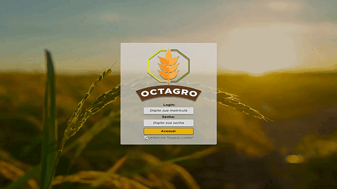
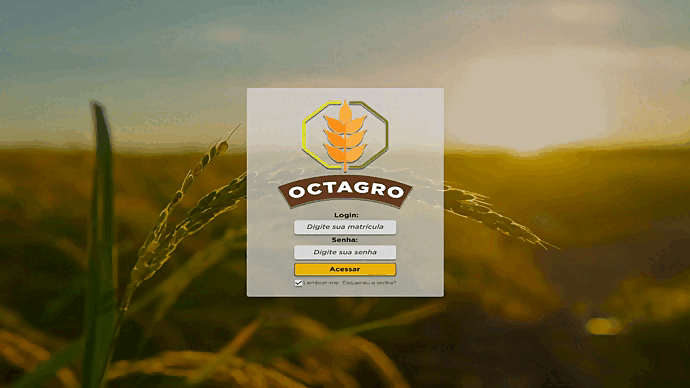

# Aprendizagem por Projetos Integrados - Sistema ERP

## FATEC -  Profº Jessen Vidal, SJC - 2º Semestre DSM - 2023/1

      
      <h3 align="center">🌾 OctAgro 🐮</h3>

      <a href="#API">Aprendizagem por Projetos Integrados</a> •
      <a href="#sobre">Sobre</a> •
      <a href="#tecnologias">Tecnologias utilizadas</a> • 
      <a href="#backlogeral">Backlog do produto</a> • 
      <a href="#equipe">Equipe</a> • 

<h3 align="center"><a href="#sprint1">Sprint 1</a></h3>

## Aprendizagem por Projetos Integrados 
A API (Aprendizagem por Projetos Integrados), é um projeto semestral realizado pela turma de Desenvolvimento de Software Multiplataforma - Fatec SJC, Jessen Vidal.
 
O intuito é aprender ao mesmo tempo em que colocamos a mão na massa, utilizando o método Scrum (metodologia ágil) como forma de administrar o projeto.

## Sobre o Projeto 

No primeiro semestre de 2023, o nosso cliente é a empresa <a href="https://jaia.software/"> Jaia Software</a>, e nos fora proposto "Desenvolver um sistema de Inspeção de entrada para controle de recebimento de grãos."
 

## 💻 Tecnologias Utilizadas 
Iremos utilizar a combinação de: MySQL, Express, React e Node.

## 📝 Backlog do produto 

| Sprint | US  | Tarefa  | Descrição | Prioridade |
|:------:|:---:|:--------|:----------|:-----------|
|  01    | *   | Criação do Mockup.|Realizar o Mockup do software para apresentação pro cliente.| Alta

## 🗂️ Sprints 

<h2>Sprint 1 </h2>

| Sprint | US  | Tarefa                                                       | Descrição                                                   | Prioridade |
|:------:|:---:|:-------------------------------------------------------------|:------------------------------------------------------------|:-----------|
|  01    | *   | Criação do Mockup.                                           | Realizar o Wireframe do software para apresentação pro cliente. | Alta
|  01    | *   | Criação do Banco de dados.                                   | Criar o banco de dados do projeto.                              | Alta
|  01    | *   | Criação do Protótipo navegável.                              | Realizar um Protótipo navegável do software.                    | Alta
|  01    | *   | Documentação do software.                                    | Realizar a documentação do software.                            | Alta
|  01    | *   | Criação da arquitetura básica e configuração dos arquivos.   | Criação de CRUD básico.                                         | Alta

<h2>📉 Burndown 1</h2>

      

<h2>Demonstração - Gifs</h2>

      <h3>Visão do Admin</h3>
      
      <h3>Visão do Recebedor</h3>
      
      <h3>Visão do Analista</h3>
      
      <h3>Visão do Aprovador</h3>
      

<h3> Sprint 1: [13/03/23-02/04/23]</h3> 

## :mortar_board: Equipe 

| Membro                | Função        | Github                                                                                                                                                | Linkedin                                                                                                                                                                                         |
| :-------------------: | :-----------: | :---------------------------------------------------------------------------------------------------------------------------------------------------: | :----------------------------------------------------------------------------------------------------------------------------------------------------------------------------------------------: | 
| Leandro Luz         | Scrum Master  |    | <a href="https://www.linkedin.com/in/leandro-f-luz/">                                  |
| Felipe Augusto       | Product Owner |  | - |</a>                |
| Gabriel Briscese    | Desenvolvedor |      |                               |
| Igor Pereira        | Desenvolvedor |    |                       |
| Igor Sasaki   | Desenvolvedor |  |  
| Jean Faria   | Desenvolvedor |  |  
| Jonas Ribeiro   | Desenvolvedor |  |  
| Thiago Zani   | Desenvolvedor |  |  
