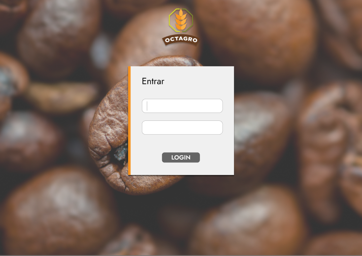

# Aprendizagem por Projetos Integrados - Sistema ERP

## FATEC -  Profº Jessen Vidal, SJC - 2º Semestre DSM - 2023/1

      
      <h3 align="center">🌾 OctAgro 🐮</h3>

<a href="#API">Aprendizagem por Projetos Integrados</a> •
 <a href="#sobre">Sobre</a> •
 <a href="#tecnologias">Tecnologias utilizadas</a> •
 <a href="#comousar">Como Utilizar</a> • 
 <a href="#demonstracao">Demonstração</a> • 
 <a href="#userstories">User Stories</a> • 
 <a href="#backlogeral">Backlog do produto</a> • 
 <a href="#backlogs">Sprints</a> • 
 <a href="#equipe">Equipe</a> • 

<h3 align="center">Sprints</h3>

      <a href="#sprint1">Sprint 1</a>    

## Aprendizagem por Projetos Integrados 
A API (Aprendizagem por Projetos Integrados), é um projeto semestral realizado pela turma de Desenvolvimento de Software Multiplataforma - Fatec SJC, Jessen Vidal.
 
O intuito é aprender ao mesmo tempo em que colocamos a mão na massa, utilizando o método Scrum (metodologia ágil) como forma de administrar o projeto.

## Sobre o Projeto 

No primeiro semestre de 2023, o nosso cliente é a empresa <a href="https://jaia.software/"> Jaia Software</a>, e nos fora proposto "Desenvolver um sistema de Inspeção de entrada para controle de recebimento de grãos."
 

## 💻 Tecnologias Utilizadas 
Iremos utilizar a combinação de: MySQL, Express, React e Node.

## 📄 User Stories 

| Código (US) | Quem       | US                                                                                                                                                   | Sprint                                                |
| :----: | :--------- | :------------------------------------------------------------------------------------------------------------------------------------------------------- | :-------------------------------------------------- |
|  #01   | Geral | Como usuário do sistema, desejo fazer o login e logout, para entrar e sair da minha conta.   | 02
|  #02   | Recebedor/Analista | Como Recebedor/Analista, desejo registrar, editar ou excluir a entrada da mercadoria descrevendo suas principais características para que o processo de análise seja possível. | 02
|  #03   | Recebedor/Analista |Como Recebedor/Analista, desejo a criação de um relatório baseado nas informações de comparação entre o Relatório de Compras, a Nota Fiscal e a Mercadoria, para que haja prosseguimento na aprovação da entrada do grão no estoque. | 02
|  #04   | Recebedor/Analista | Como Recebedor/Analista, desejo comparar as características da mercadoria recebida com as informações da mercadoria descritas no Relatório de Compras e na Nota Fiscal para aprovação ou rejeição da entrada. | 02
|  #05   | Aprovador | Como Aprovador, desejo validar a mercadoria que foi inspecionada para a entrada do estoque, mesmo ela estando rejeitada pelos critérios. | 02
|  #06 | Administrador | Como Administrador, desejo gerenciar fornecedores de forma com que eles sejam cadastrados no sistema para que facilite os dados tanto do fornecedor quanto do produto. | 03
|  #07 | Administrador | Como Administrador, desejo gerenciar produtos (grãos) para caracterizar a mercadoria de forma em que ela possa ser recebida, analisada e aprovada de forma eficiente. | 03
|  #08 | Administrador | Como Administrador, desejo gerenciar regras de recebimento para determinar o conjunto de critérios a serem seguidos no processo de análise e aprovação da entrada de mercadorias. | 03
|  #09 | Administrador | Como Administrador, desejo gerenciar usuários colaboradores (recebedores, analistas e aprovadores) de forma com que seja possível criar, editar ou apagar as contas associadas a eles. | 04
|  #10 | Geral | Como usuário do sistema, desejo um sistema com ambientação limitada por usuário, para trabalhar em um ambiente limpo e intuitivo para minha função. | 04
|  #11 | Geral | Como usuário do sistema, desejo um sistema de fácil acesso e que seja responsivo, para facilitar a navegação entre as aplicações e poder acessar a partir de qualquer dispositivo. | 04

## 📝 Backlog do produto 

| Sprint | US  | Tarefa  | Descrição | Prioridade |
|:------:|:---:|:--------|:----------|:-----------|
|  01    | *   | Criação do Wireframe.|Realizar o Wireframe do software para apresentação pro cliente.| Alta
|  01    | *   | Criação do Banco de dados. | Criar o banco de dados do projeto. | Alta
|  01    | *   | Criação do Protótipo navegável. | Realizar um Protótipo navegável do software. | Alta
|  01    | *   | Documentação do software. | Realizar a documentação do software. | Alta
|  01    | *   | Criação da arquitetura básica e configuração dos arquivos. | Criação de CRUD básico. | Alta
|  02    | 01  | Criação da tela de login. | Criação da tela de login com usuário e senha. | Alta
|  02    | 01  | Validação e Redirecionamento do usuário. | Validar o usuário e senha no banco de dados. | Alta
|  02    | 01  | Criação e Funcionamento do logout. |Criar o botão de logout e ao clicar, encerrar a sessão do usuário e redirecionar para a tela de login. | Alta
|  02    | 02  | Criação da tela de listagem de mercadorias a serem cadastradas. | Criar uma tela onde liste as mercadorias que estão na fila para o cadastro delas para prosseguirem para a análise | Alta
|  02    | 02  | Criação tela de cadastro de entrada de mercadoria. | Criar uma tela de cadastro de entrada de mercadoria, com campos para a descrição das características principais da mercadoria. | Alta
|  02    | 02  | Implementação da entrada da mercadoria no banco de dados. | Implementar a funcionalidade de salvar a entrada da mercadoria no banco de dados, após o preenchimento dos campos pelo usuário. | Alta
|  02    | 02  | Implementação da alteração da mercadoria no banco de dados. | Implementar a funcionalidade de visualizar, editar e excluir as informações de entrada de mercadorias cadastradas. | Alta
|  02    | 03  | Desenvolver o relatório entre o relatório de compra, nota fiscal e mercadoria. | Desenvolver um relatório com as comparação entre as informações inseridas e gerar um resultado com as diferenças encontradas. | Alta
|  02    | 04  | Criação da tela de listagem de mercadorias a serem analisadas. | Criar uma tela onde liste as mercadorias que estão na fila para análise. | Alta
|  02    | 04  | Criação da tela de análise da mercadoria. | Criação da tela de análises com os campos a serem comparados pelo analista. | Alta
|  02    | 04  | Implementação da aprovação e negação na análise da mercadoria com relatório. | Criação dos botões de rejeição e aprovação, com a geração de um relatório das regras aprovados e rejeitados. | Alta
|  02    | 05  | Criação da tela de listagem de mercadorias a serem aprovadas. | Criar uma tela onde liste as mercadorias que estão na fila para aprovação. | Alta
|  02    | 05  | Criação da tela de aprovação ou rejeição da mercadoria para o aprovador. | Criar tela do aprovador com os botões de aprovação e rejeição, podendo ele avaliar através do relatório da analise se entrará no estoque. | Alta
|  02    | 05  | Implementação da aprovação ou negação da mercadoria no estoque. | Atualizar o status da entrada da mercadoria no banco de dados. | Alta
|  03    | 06  | Criar um formulário para visualizar a lista de fornecedores. | Criar um formulário de listagem dos fornecedores com as informações necessárias e botões de adicionar, alterar e excluir. | Média
|  03    | 06  |Criar o formulário de cadastro dos fornecedores. | Criar um formulário de cadastro de fornecedores com as informações necessárias, como nome, endereço, CNPJ, entre outras. | Média
|  03    | 06  | Implementar o cadastro do fornecedor. | Implementar a funcionalidade de salvar o novo fornecedor no banco de dados, após o preenchimento dos campos. | Média
|  03    | 06  | Implementar a alteração do fornecedor. | Implementar a funcionalidade de editar e excluir as informações de entrada dos fornecedores cadastradas. | Média
|  03    | 07  | Criar um formulário para visualizar a lista de produtos. | Criar um formulário de listagem dos produtos com as informações necessárias e botões de adicionar, alterar e excluir. | Média
|  03    | 07  | Criar o formulário de cadastro dos produtos. | Criar um formulário de cadastro de produtos com as informações necessárias, como nome, tipo, regras, entre outras. | Média
|  03    | 07  | Implementar o cadastro do produto. | Implementar a funcionalidade de salvar o produto no banco de dados, após o preenchimento dos campos na tela de cadastro. | Média
|  03    | 07  | Implementar a alteração do produto. | Implementar a funcionalidade de editar e excluir as informações de entrada dos produtos cadastradas. | Média
|  03    | 08  | Criar um formulário para visualizar a lista das regras de recebimento. | Criar um formulário de listagem das regras com as informações necessárias e botões de adicionar, alterar e excluir. | Média
|  03    | 08  | Criar o formulário de cadastro das regras de recebimento. | Criar um formulário de cadastro das regras com as informações necessárias. | Média
|  03    | 08  | Implementar o cadastro das regras de recebimento. | Implementar a funcionalidade de salvar a regra ao seu produto no banco de dados, após o preenchimento dos campos na tela de cadastro. | Média
|  03    | 08  | Implementar a alteração das regras de recebimento. | Implementar a funcionalidade de editar e excluir as informações das regras cadastradas. | Média
|  04    | 09  | Criar um formulário para visualizar a lista dos usuários cadastrados. | Criar um formulário de listagem dos usuários com as informações necessárias e botões de adicionar, alterar e excluir. | Baixa
|  04    | 09  | Criar o formulário de cadastro dos usuários. | Criar um formulário de cadastro dos usuários com as informações necessárias. | Baixa
|  04    | 09  | Implementar o cadastro dos usuários. | Implementar a funcionalidade de salvar o novo usuário no banco de dados, após o preenchimento dos campos na tela de cadastro. | Baixa
|  04    | 09  | Implementar a alteração dos usuários. | Implementar a funcionalidade de editar e excluir as informações dos usuários cadastradas. | Baixa
|  04    | 10  | Alteração da telas para organização por usuário. | Definir quais informações são relevantes para cada tipo de usuário e apresentá-las de forma clara e organizada. | Baixa
|  04    | 11  | Implementação do sistema responsivo. | Avaliar a interface do sistema em diferentes dispositivos (computador, tablet, celular) para garantir que seja responsiva e de fácil acesso em todas as plataformas. | Baixa

## ❓Como Utilizar 

## 🗂️ Sprints 
## Sprint 1 

| Sprint | US  | Tarefa                                                       | Descrição                                                   | Prioridade |
|:------:|:---:|:-------------------------------------------------------------|:------------------------------------------------------------|:-----------|
|  01    | *   | Criação do Mockup.                                           | Realizar o Wireframe do software para apresentação pro cliente. | Alta
|  01    | *   | Criação do Banco de dados.                                   | Criar o banco de dados do projeto.                              | Alta
|  01    | *   | Criação do Protótipo navegável.                              | Realizar um Protótipo navegável do software.                    | Alta
|  01    | *   | Documentação do software.                                    | Realizar a documentação do software.                            | Alta
|  01    | *   | Criação da arquitetura básica e configuração dos arquivos.   | Criação de CRUD básico.                                         | Alta

## 📉 Burndown 1

# Mockups
# Demonstração

      <h4>Tela de login</h4>
      
      <h4>Listagem de usuários</h4>
      
      <h4>Tela de Validação de produto</h4>
      

# Demonstração - Gifs

      <h4>Visão do Admin</h4>
      
      <h4>Visão do Recebedor</h4>
      
      <h4>Visão do Analista</h4>
      
      <h4>Visão do Aprovador</h4>
      

<h3> Sprint 1: [12/03/23-31/03/23]</h3> 

## :mortar_board: Equipe 

| Membro                | Função        | Github                                                                                                                                                | Linkedin                                                                                                                                                                                         |
| :-------------------: | :-----------: | :---------------------------------------------------------------------------------------------------------------------------------------------------: | :----------------------------------------------------------------------------------------------------------------------------------------------------------------------------------------------: | 
| Leandro Luz         | Scrum Master  |    | <a href="https://www.linkedin.com/in/leandro-f-luz/">                                  |
| Felipe Augusto       | Product Owner |  | - |</a>                |
| Gabriel Briscese    | Desenvolvedor |      |                               |
| Igor Pereira        | Desenvolvedor |    |                       |
| Igor Sasaki   | Desenvolvedor |  |  
| Jean Faria   | Desenvolvedor |  |  
| Jonas Ribeiro   | Desenvolvedor |  |  
| Thiago Zani   | Desenvolvedor |  |  
