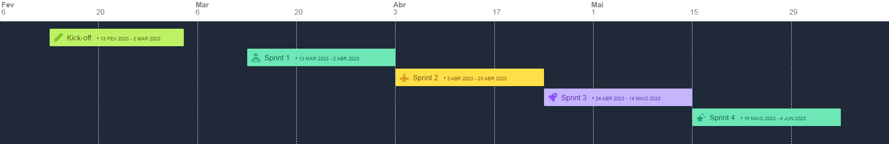
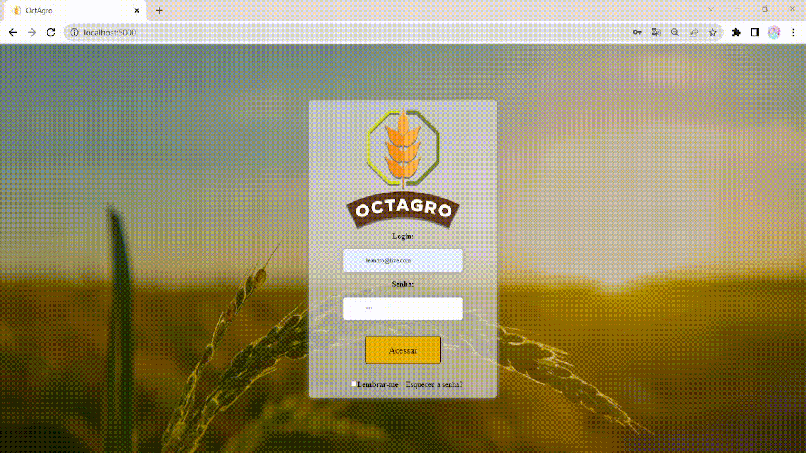

# Aprendizagem por Projetos Integrados - Sistema ERP

## FATEC -  Profº Jessen Vidal, SJC - 2º Semestre DSM - 2023/1

      
      <h3 align="center">🌾 OctAgro 🐮 - Sprint 2</h3>

      <a href="#sobre">Sobre</a> •
      <a href="#backlog">Backlog do produto</a> •
      <a href="#demo">Demonstração</a> •
      <a href="#burndown">BurnDown</a> •
      <a href="#equipe">Equipe</a> 

## Sobre o Projeto 

No primeiro semestre de 2023, o nosso cliente é a empresa <a href="https://jaia.software/"> Jaia Software</a>, e nos fora proposto "Desenvolver um sistema de Inspeção de entrada para controle de recebimento de grãos".

##  MVP

Desenvolvimento das paginas do recebedor, analista e aprovador, Criação das funcionalidades de avaliação da mercadoria a aprovação da mesma

## Entregas

<h2>BackLog </h2>

| Sprint | US  | Tarefa                                                       | Descrição                                                   | Prioridade |
|:------:|:---:|:-------------------------------------------------------------|:------------------------------------------------------------|:-----------|
|  02    | 02  | Controle de entrada de mercadoria. | Criar as telas de home do recebedor, entrada da mercadoria, inspeção da mercadoria , mercadorias cadastradas. Criar as funções de inserção, alteração e exclusão das mercadorias. | Alta
|  02    | 03  | Geração de relatorios por usuário. | Criar as funções de geração dos relatorios por usuário (recebedor,analista e aprovador). | Alta
|  02    | 04  | Controle de analise de mercadoria. | Criar as telas de home do analista, mercadorias para analise e a tela de  analise. Criar as funções de inserção da analise. | Alta
|  02    | 05  | Controle de aprovação. | Criar as telas de home do aprovador, mercadorias para aprovação e a tela de  aprovação. Criar as funções de inserção da aprovação e entrada no estoque. | Alta
|  02    | 01  | Login e Logout. | Criação da tela de login. Criação das funções de autenticação e logout do usuário. | Média

<h2>Demonstração - Gifs</h2>

    <h3>Visão dos usuários (Recebedor, Analista e Aprovador)</h3>
    
    
     

<h3> Sprint 2: [03/04/23-23/04/23]</h3> 

<h2>BurnDown</h2>

## :mortar_board: Equipe 

|   | Membro                | Função        | Github                                                                                                                                                | Linkedin                                                                                                                                                                                         |
| :--: | :-------------------: | :-----------: | :---------------------------------------------------------------------------------------------------------------------------------------------------: | :----------------------------------------------------------------------------------------------------------------------------------------------------------------------------------------------: | 
| | Leandro Luz         | Scrum Master  |    | <a href="https://www.linkedin.com/in/leandro-f-luz/">                                 |
|  | Felipe Augusto       | Product Owner |  | - |</a>                |
|  | Gabriel Briscese    | Desenvolvedor |      |                               |
| | Igor Pereira        | Desenvolvedor |    |                       |
|  | Igor Sasaki   | Desenvolvedor |  |  
|  | Jean Faria   | Desenvolvedor |  |  
|  | Jonas Ribeiro   | Desenvolvedor |  |  
|  | Thiago Zani   | Desenvolvedor |  |  
