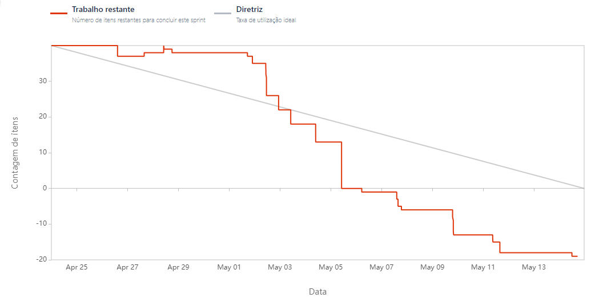

# Aprendizagem por Projetos Integrados - Sistema ERP

## FATEC -  Profº Jessen Vidal, SJC - 2º Semestre DSM - 2023/1

      
      <h3 align="center">🌾 OctAgro 🐮 - Sprint 3</h3>

      <a href="#sobre">Sobre</a> •
      <a href="#backlog">Backlog do produto</a> •
      <a href="#demo">Demonstração</a> •
      <a href="#burndown">BurnDown</a> •
      <a href="#equipe">Equipe</a> 

## Sobre o Projeto 

No primeiro semestre de 2023, o nosso cliente é a empresa <a href="https://jaia.software/"> Jaia Software</a>, e nos fora proposto "Desenvolver um sistema de Inspeção de entrada para controle de recebimento de grãos".

##  MVP

Desenvolvimento das paginas do gerente aprovador, controle de produtos e fornecedores por parte do Administrador

## Entregas

 

<h2>BackLog </h2>

| Sprint | US  | Requisito                                               | Descrição                                                   | Prioridade |
|:------:|:---:|:-------------------------------------------------------------|:------------------------------------------------------------|:-----------|
|  03    | 05  | Gereciamento de gerente como aprovador. | Criar o controle de gerente por parte do aprovador. | Média
|  03    | 06  | Controle dos fornecedores. | Criar um formulário de listagem dos fornecedores com as informações necessárias e botões de adicionar, alterar e excluir. | Média
|  03    | 07  | Controle dos produtos. | Criar um formulário de listagem dos produtos com as informações necessárias e botões de adicionar, alterar e excluir. | Média

<h2>User Stories </h2>

| US_Id | US | Usuário |
|:-----:|:---|:--------|
| 05    | Como Aprovador, desejo validar a mercadoria que foi inspecionada para a entrada do estoque, mesmo ela estando rejeitada pelos critérios. | Aprovador
| 06    | Como Administrador, desejo gerenciar fornecedores de forma com que eles sejam cadastrados no sistema para que facilite os dados tanto do fornecedor quanto do produto. | Admin
| 07    | Como Administrador, desejo gerenciar produtos (grãos) para caracterizar a mercadoria de forma em que ela possa ser recebida, analisada e aprovada de forma eficiente. | Admin

<h2>Demonstração - Gifs</h2>

    <h3>Visão dos usuários (Gerente aprovador, Controle de produtos ADM e Controle de fornecedores ADM)</h3>
    
    
     

<h3> Sprint 3: [24/04/23-14/05image.png/23]</h3> 

<h2>BurnDown</h2>

## :mortar_board: Equipe 

|   | Membro                | Função        | Github                                                                                                                                                | Linkedin                                                                                                                                                                                         |
| :--: | :-------------------: | :-----------: | :---------------------------------------------------------------------------------------------------------------------------------------------------: | :----------------------------------------------------------------------------------------------------------------------------------------------------------------------------------------------: | 
| | Gabriela Barbosa       | Scrum Master  |    | <a href="https://www.linkedin.com/in/gabrieladsbarbosa">                                 |
|  | Felipe Augusto       | Product Owner |  | - |</a>                |
|  | Gabriel Briscese    | Desenvolvedor |      |                               |
| | Igor Pereira        | Desenvolvedor |    |                       |
|  | Jean Faria   | Desenvolvedor |  |  
|  | Jonas Ribeiro   | Desenvolvedor |  |  
|  | Thiago Zani   | Desenvolvedor |  |  
