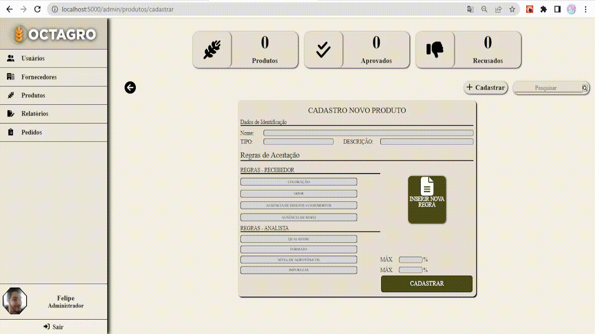
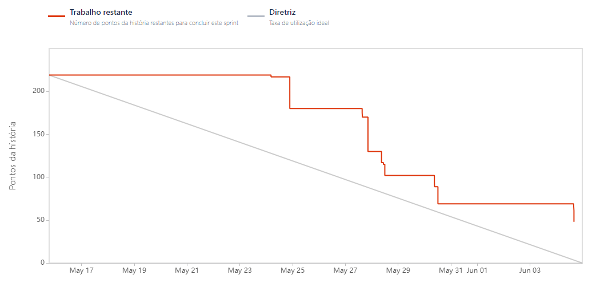

# Aprendizagem por Projetos Integrados - Sistema ERP

## FATEC -  Profº Jessen Vidal, SJC - 2º Semestre DSM - 2023/1

      
      <h3 align="center">🌾 OctAgro 🐮 - Sprint 4</h3>

      <a href="#sobre">Sobre</a> •
      <a href="#backlog">Backlog do produto</a> •
      <a href="#demo">Demonstração</a> •
      <a href="#burndown">BurnDown</a> •
      <a href="#equipe">Equipe</a> 

## Sobre o Projeto 

No primeiro semestre de 2023, o nosso cliente é a empresa <a href="https://jaia.software/"> Jaia Software</a>, e nos fora proposto "Desenvolver um sistema de Inspeção de entrada para controle de recebimento de grãos".

## MVP

Desenvolvimento das paginas do gerente aprovador, controle de produtos e fornecedores por parte do Administrador

## Entregas

 

<h2>BackLog </h2>

| Sprint | US  | Requisito                                               | Descrição                                                   | Prioridade |
|:------:|:---:|:-------------------------------------------------------------|:------------------------------------------------------------|:-----------|
|  04    | 08  | Controle das regras de recebimento. | Criar um formulário de listagem das regras com as informações necessárias e botões de adicionar, alterar e excluir. | Média
|  04    | 09  | Controle dos usuarios. | Criar um formulário de listagem dos usuários com as informações necessárias e botões de adicionar, alterar e excluir. | Baixa
|  04    | 03  | Controle de relatorios do ADM. | Criar um formulário de listagem de todos os relatorios. | Baixa
| 04     | 03  | Geração dos gráficos.  | Gerar os graficos na tela de home do administrador. | Baixa 

<h2>User Stories </h2>

| US_Id | US | Usuário |
|:-----:|:---|:--------|
| 03    | Como Admin, desejo a criação de um relatório baseado nas informações de comparação entre o Relatório de Compras, a Nota Fiscal e a Mercadoria, para que haja prosseguimento na aprovação da entrada do grão no estoque | Admin
| 08    | Como Administrador, desejo gerenciar regras de recebimento para determinar o conjunto de critérios a serem seguidos no processo de análise e aprovação da entrada de mercadorias. | Admin
| 09    | Como Administrador, desejo gerenciar usuários colaboradores (recebedores, analistas e aprovadores) de forma com que seja possível criar, editar ou apagar as contas associadas a eles. | Admin

<h2>Demonstração - Gifs</h2>

      <h3>Controle de regras de recebimento | Controle de usuários | Geração de gráficos e Controle de relatorios</h3>
    
    
    

<h3> Sprint 4: [15/05/23-04/06/23]</h3> 

<h2>BurnDown</h2>

## :mortar_board: Equipe 

|   | Membro                | Função        | Github                                                                                                                                                | Linkedin                                                                                                                                                                                         |
| :--: | :-------------------: | :-----------: | :---------------------------------------------------------------------------------------------------------------------------------------------------: | :----------------------------------------------------------------------------------------------------------------------------------------------------------------------------------------------: | 
| | Gabriela Barbosa       | Scrum Master  |    | <a href="https://www.linkedin.com/in/gabrieladsbarbosa">                                 |
|  | Felipe Augusto       | Product Owner |  | - |</a>                |
|  | Gabriel Briscese    | Desenvolvedor |      |                               |
| | Igor Pereira        | Desenvolvedor |    |                       |
|  | Jean Faria   | Desenvolvedor |  |  
|  | Jonas Ribeiro   | Desenvolvedor |  |  
|  | Thiago Zani   | Desenvolvedor |  |  
